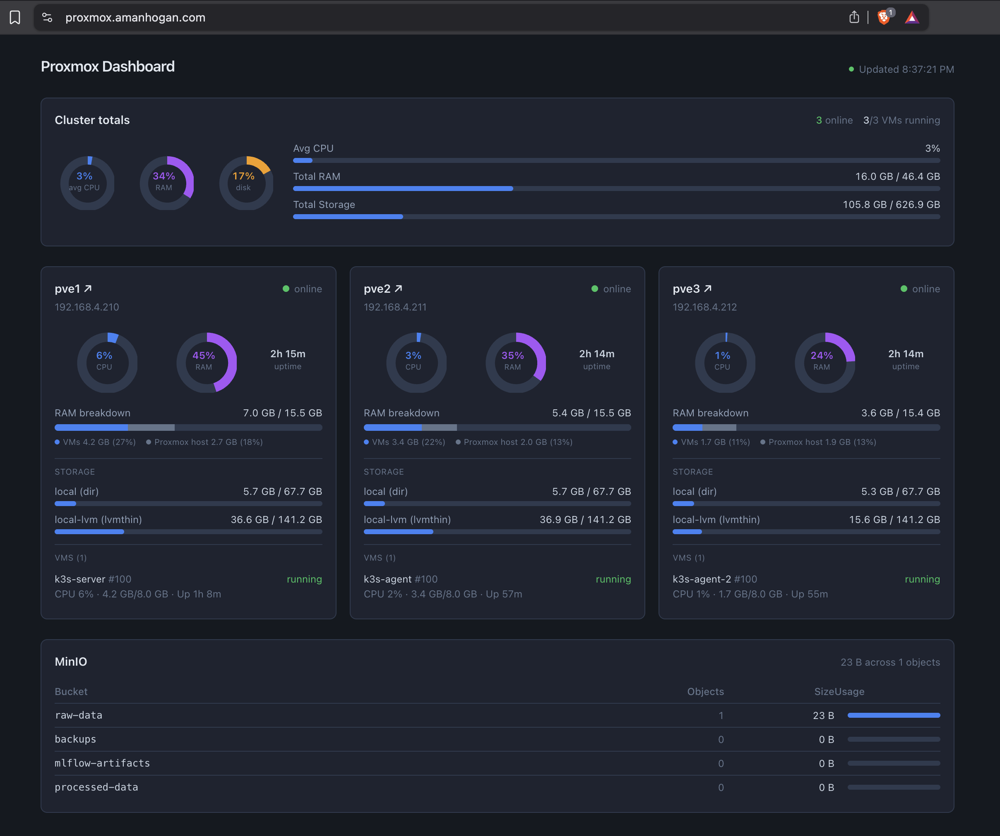
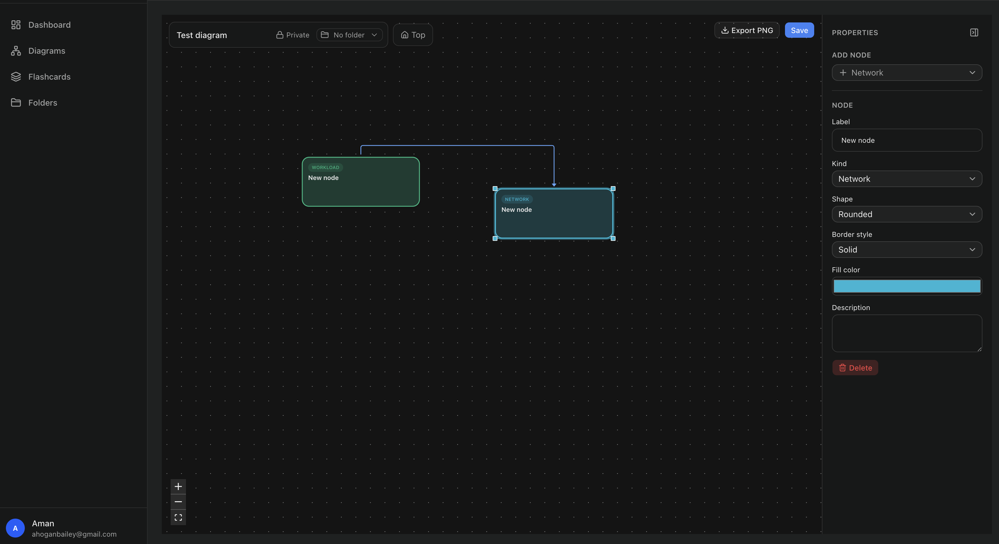
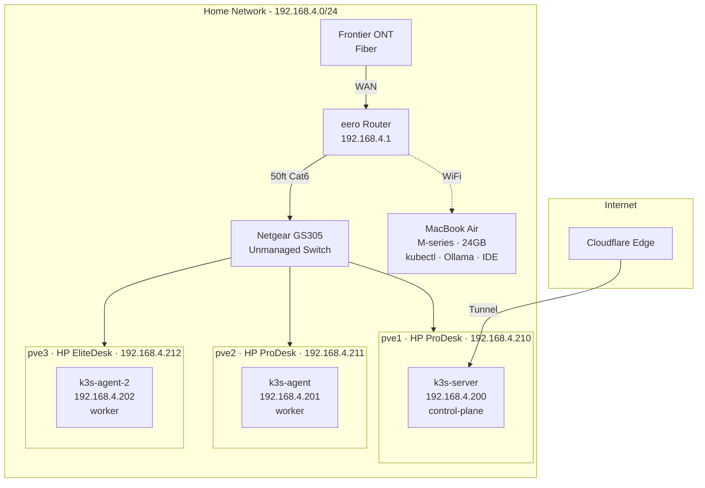
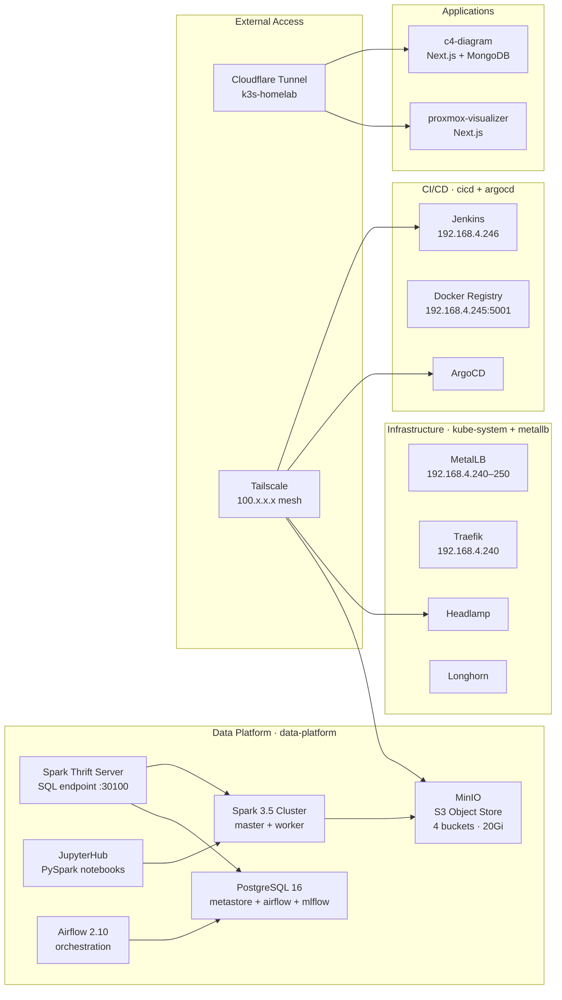
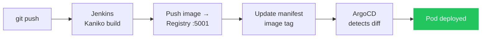
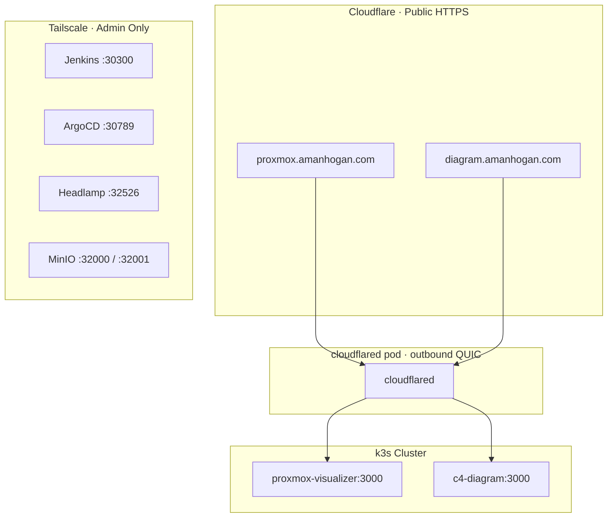
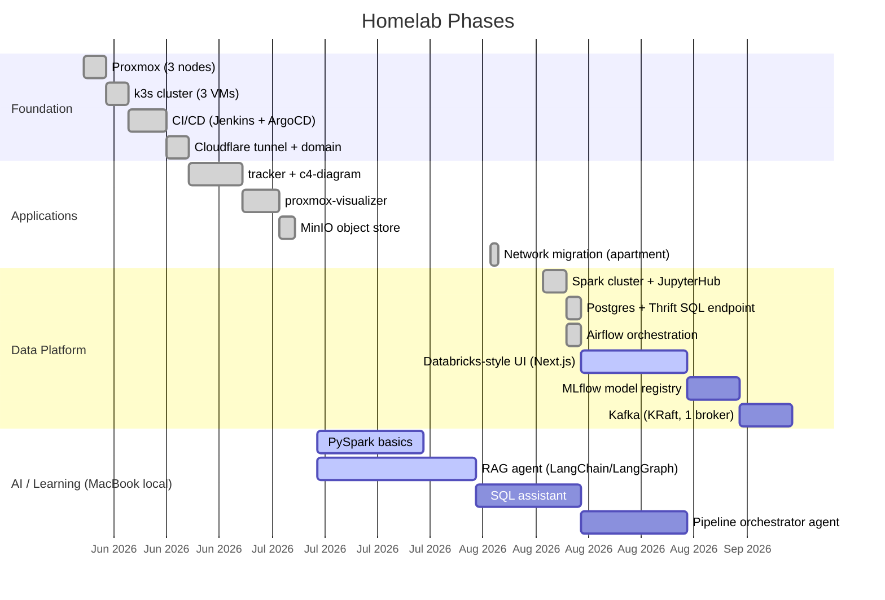
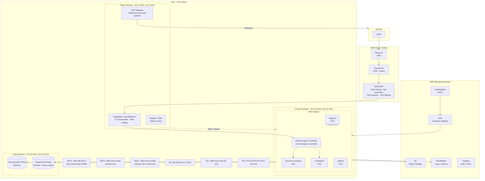

# k3s Data Platform

Bare-metal homelab running a 3-node k3s Kubernetes cluster on Proxmox VE, with a full CI/CD pipeline, public access via Cloudflare, and a growing Databricks-style data platform. Built as a learning project — every piece deployed from scratch, not managed services.
**Last updated:** 2026-08-14

## Screenshots

| Proxmox Dashboard | C4 Diagram |
|---|---|
|  |  |

## Architecture

### Physical → Cluster



### Kubernetes Services



### GitOps Pipeline



### External Access



## Roadmap



## IP Map

| Resource               | IP             | Notes                               |
| ---------------------- | -------------- | ----------------------------------- |
| eero Router            | 192.168.4.1    | Gateway + DHCP                      |
| pve1 (Proxmox)         | 192.168.4.210  | HP ProDesk, i5-7500T, 16GB          |
| pve2 (Proxmox)         | 192.168.4.211  | HP ProDesk, i5-7500T, 16GB          |
| pve3 (Proxmox)         | 192.168.4.212  | HP EliteDesk 800 G4, i5-8500T, 16GB |
| k3s-server             | 192.168.4.200  | control-plane (VM on pve1)          |
| k3s-agent              | 192.168.4.201  | worker (VM on pve2)                 |
| k3s-agent-2            | 192.168.4.202  | worker (VM on pve3)                 |
| Traefik                | 192.168.4.240  | MetalLB                             |
| Docker Registry        | 192.168.4.245  | MetalLB, HTTP (insecure, internal)  |
| Jenkins                | 192.168.4.246  | MetalLB                             |
| Tailscale (k3s-server) | 100.112.249.53 | kubectl + admin UIs                 |

## Admin Access (Tailscale only)

| Service        | URL                            |
| -------------- | ------------------------------ |
| Jenkins        | `http://100.112.249.53:30300`  |
| ArgoCD         | `https://100.112.249.53:30789` |
| Headlamp       | `http://100.112.249.53:32526`  |
| MinIO Console  | `http://100.112.249.53:32001`  |
| JupyterHub     | `http://100.112.249.53:30888`  |
| Spark UI       | `http://100.112.249.53:30808`  |
| Spark SQL JDBC | `jdbc:hive2://100.112.249.53:30100` |
| Airflow        | `http://100.112.249.53:30880`  |
| Proxmox (pve1) | `https://192.168.4.210:8006`   |
| Proxmox (pve2) | `https://192.168.4.211:8006`   |
| Proxmox (pve3) | `https://192.168.4.212:8006`   |

## Repo Structure

```
k3s-data-platform/
├── PLAN.md                    # detailed build plan with phases
├── docs/
│   ├── setup-log.md           # step-by-step record of everything done
│   ├── hp-node-3-thermal-fix.md
│   └── learning-path.md
├── platform/                  # infrastructure manifests
│   ├── airflow/               # orchestration (LocalExecutor + Postgres)
│   ├── cloudflare/
│   ├── jenkins/
│   ├── jupyterhub/            # PySpark notebooks
│   ├── metallb/
│   ├── minio/
│   ├── mongodb/               # shared MongoDB template
│   ├── postgres/              # shared DB: hive_metastore, airflow, mlflow
│   ├── registry/
│   ├── spark/                 # Spark master + worker
│   └── spark-thrift/          # HiveServer2-compatible SQL endpoint
├── manifests/                 # app deployment manifests (ArgoCD watches these)
│   ├── c4-diagram/
│   ├── commitments/
│   └── proxmox-visualizer/
└── argocd-apps/               # ArgoCD Application CRs
```

## Cloud Equivalent — "What This Would Look Like in Production"

This homelab maps directly to a production AWS architecture. The diagram below shows how each homelab component translates to its cloud-native equivalent, with the security and networking layers you'd add in a real enterprise deployment.

### Homelab → AWS Mapping

| Homelab Component | AWS Equivalent | Why |
|---|---|---|
| Proxmox VE (hypervisor) | EC2 / EKS managed nodes | AWS manages the hypervisor layer |
| k3s cluster | **EKS** (Elastic Kubernetes Service) | Managed control plane, no etcd to maintain |
| MetalLB | **AWS Load Balancer Controller** + ALB/NLB | Cloud-native L4/L7 load balancing |
| Traefik ingress | **ALB Ingress Controller** or **NGINX Ingress** | ALB handles TLS termination, path routing |
| Cloudflare Tunnel | **CloudFront** (CDN) + **WAF** | Edge caching + DDoS/bot protection |
| Cloudflare Access (email gate) | **Cognito** or **ALB + OIDC** | Identity-aware access control |
| Tailscale (admin access) | **Systems Manager Session Manager** or VPN | No inbound ports needed for admin |
| Docker Registry (in-cluster) | **ECR** (Elastic Container Registry) | Managed, no storage to maintain |
| Jenkins + Kaniko | **CodePipeline + CodeBuild** (or keep Jenkins on EKS) | Managed CI/CD, pay-per-build |
| ArgoCD | **ArgoCD on EKS** or **Flux** | GitOps works the same in cloud |
| MinIO | **S3** | MinIO is literally an S3-compatible API |
| MongoDB (local) | **DocumentDB** or **MongoDB Atlas** | Managed backups, replicas, patching |
| Longhorn (storage) | **EBS** (block) / **EFS** (shared) | CSI drivers, no local-path provisioner |
| local-path-provisioner | **EBS CSI Driver** | Dynamic PV provisioning |

### AWS Production Architecture



### Security Layers (Interview Talking Points)

```
Request flow and where each security layer applies:

User → Route 53 (DNS)
  → CloudFront (CDN, edge caching, geographic restrictions)
    → WAF (rate limiting, bot detection, OWASP rules, IP allowlists)
      → ALB (TLS termination, OIDC/Cognito auth)
        → Security Group (allow only ALB → EKS node ports)
          → NACL (stateless subnet-level firewall, deny known bad CIDRs)
            → NGINX Ingress (path routing, rate limiting, request validation)
              → Pod (Network Policy: namespace isolation, deny-all default)
                → Database (Security Group: only EKS SG on port 27017)
```

**Key concepts to mention in interviews:**
- **Defense in depth** — every layer adds a check, no single point of failure
- **Least privilege** — security groups reference other SGs, not CIDRs; pods can't talk cross-namespace by default
- **Public vs private subnets** — only ALB and NAT Gateway have public IPs; EKS nodes and databases are never internet-facing
- **NACLs vs Security Groups** — NACLs are stateless (need explicit allow for return traffic), SGs are stateful (return traffic auto-allowed). NACLs are the subnet-level coarse filter, SGs are the instance-level fine filter
- **NAT Gateway** — pods can pull images and call AWS APIs outbound, but nothing inbound reaches them except through the ALB
- **Zero-trust admin access** — no SSH. Use SSM Session Manager or `kubectl` via IAM auth, all actions logged to CloudTrail

For the full build plan and phase details, see [PLAN.md](PLAN.md).
For the step-by-step setup log, see [docs/setup-log.md](docs/setup-log.md).
