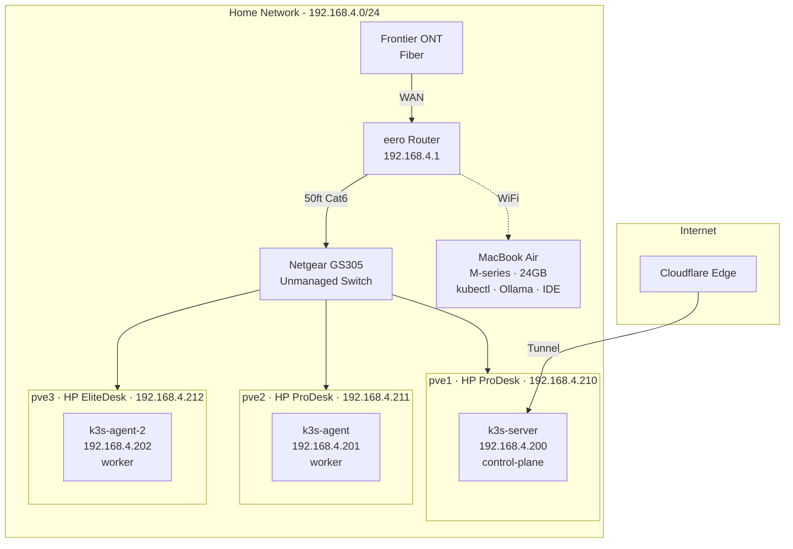
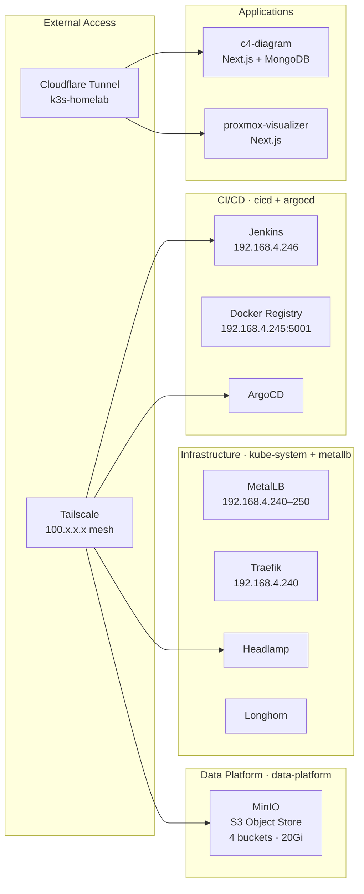
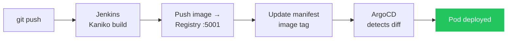
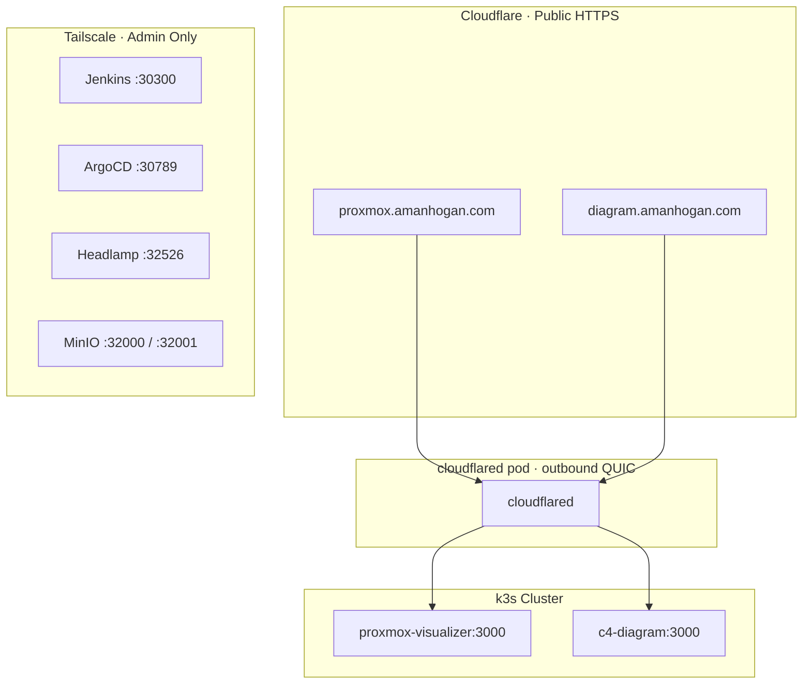
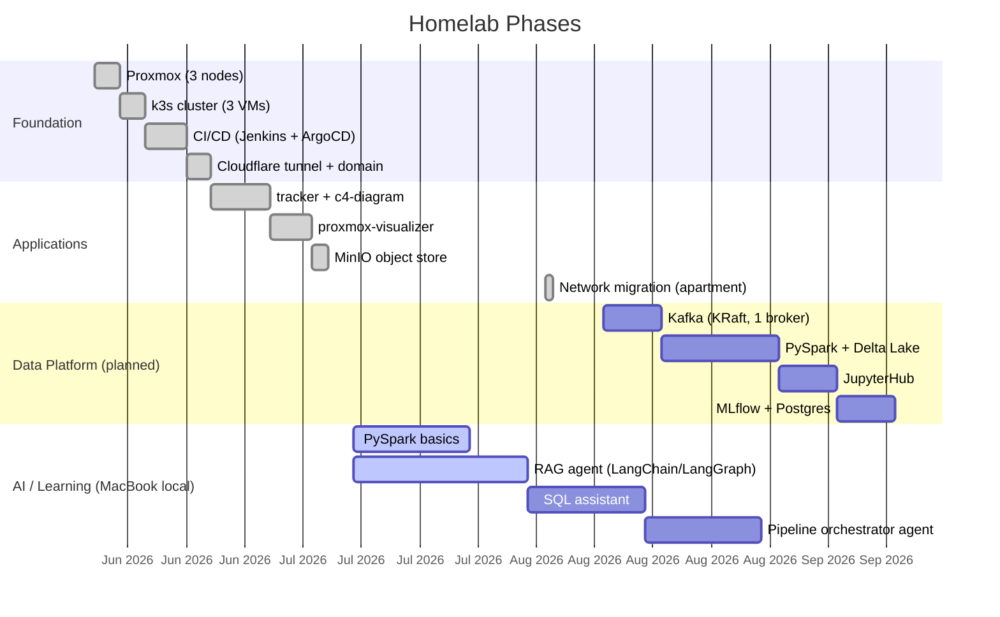

# k3s Data Platform

Bare-metal homelab running a 3-node k3s Kubernetes cluster on Proxmox VE, with a full CI/CD pipeline, public access via Cloudflare, and a growing Databricks-style data platform. Built as a learning project — every piece deployed from scratch, not managed services.
**Last updated:** 2026-08-03

## Screenshots

| Proxmox Dashboard | C4 Diagram |
|---|---|
|  |  |

## Architecture

### Physical → Cluster



### Kubernetes Services



### GitOps Pipeline



### External Access



## Roadmap



## IP Map

| Resource               | IP             | Notes                               |
| ---------------------- | -------------- | ----------------------------------- |
| eero Router            | 192.168.4.1    | Gateway + DHCP                      |
| pve1 (Proxmox)         | 192.168.4.210  | HP ProDesk, i5-7500T, 16GB          |
| pve2 (Proxmox)         | 192.168.4.211  | HP ProDesk, i5-7500T, 16GB          |
| pve3 (Proxmox)         | 192.168.4.212  | HP EliteDesk 800 G4, i5-8500T, 16GB |
| k3s-server             | 192.168.4.200  | control-plane (VM on pve1)          |
| k3s-agent              | 192.168.4.201  | worker (VM on pve2)                 |
| k3s-agent-2            | 192.168.4.202  | worker (VM on pve3)                 |
| Traefik                | 192.168.4.240  | MetalLB                             |
| Docker Registry        | 192.168.4.245  | MetalLB, HTTP (insecure, internal)  |
| Jenkins                | 192.168.4.246  | MetalLB                             |
| Tailscale (k3s-server) | 100.112.249.53 | kubectl + admin UIs                 |

## Admin Access (Tailscale only)

| Service        | URL                            |
| -------------- | ------------------------------ |
| Jenkins        | `http://100.112.249.53:30300`  |
| ArgoCD         | `https://100.112.249.53:30789` |
| Headlamp       | `http://100.112.249.53:32526`  |
| MinIO Console  | `http://100.112.249.53:32001`  |
| Proxmox (pve1) | `https://192.168.4.210:8006`   |
| Proxmox (pve2) | `https://192.168.4.211:8006`   |
| Proxmox (pve3) | `https://192.168.4.212:8006`   |

## Repo Structure

```
k3s-data-platform/
├── PLAN.md                    # detailed build plan with phases
├── docs/
│   ├── setup-log.md           # step-by-step record of everything done
│   ├── hp-node-3-thermal-fix.md
│   └── learning-path.md
├── platform/                  # infrastructure manifests
│   ├── cloudflare/
│   ├── jenkins/
│   ├── metallb/
│   ├── minio/
│   ├── mongodb/               # shared MongoDB template
│   └── registry/
├── manifests/                 # app deployment manifests (ArgoCD watches these)
│   ├── c4-diagram/
│   ├── commitments/
│   └── proxmox-visualizer/
└── argocd-apps/               # ArgoCD Application CRs
```

For the full build plan and phase details, see [PLAN.md](PLAN.md).
For the step-by-step setup log, see [docs/setup-log.md](docs/setup-log.md).
